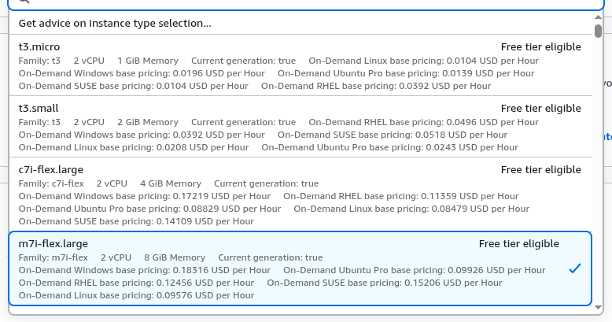
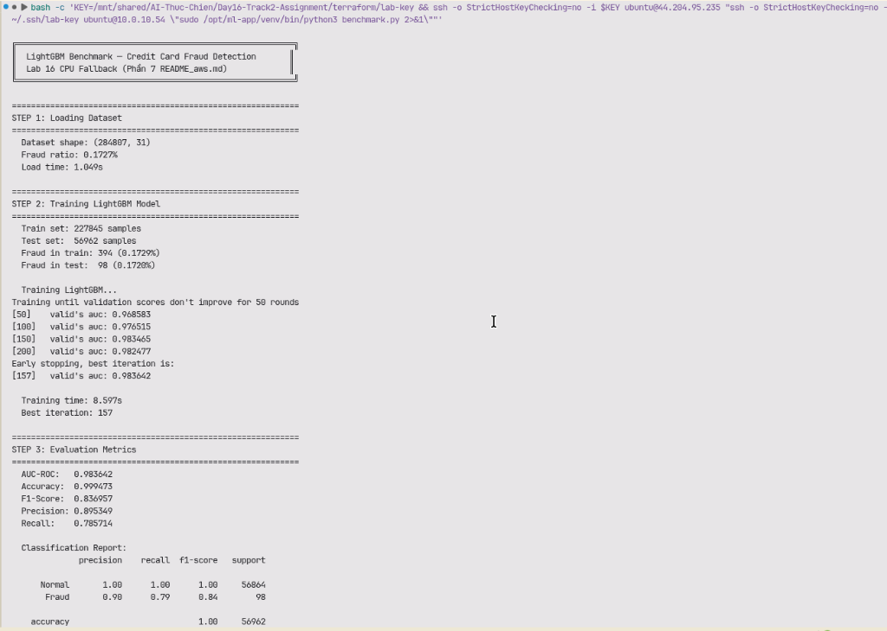
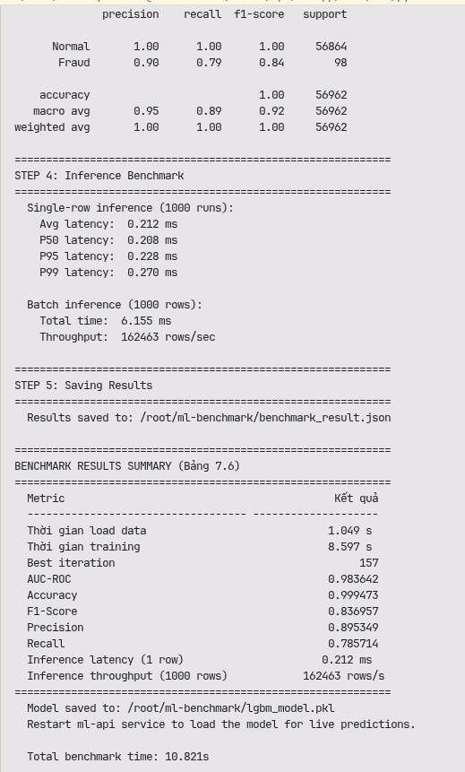
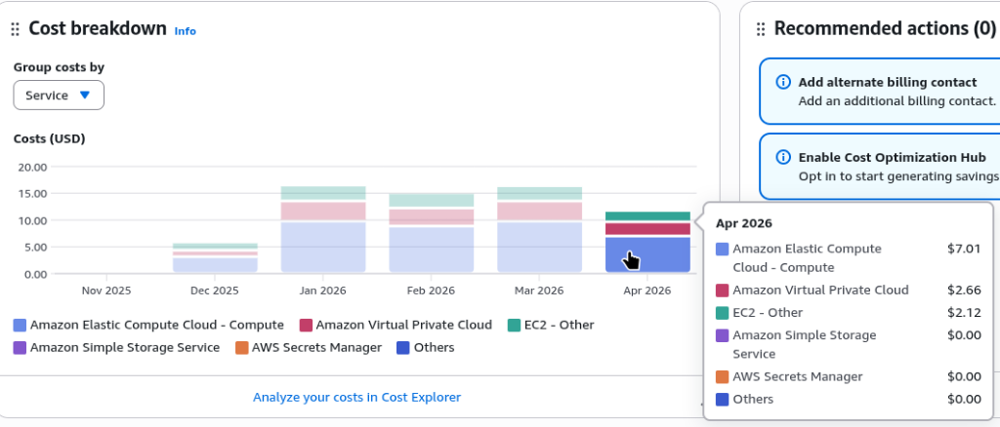
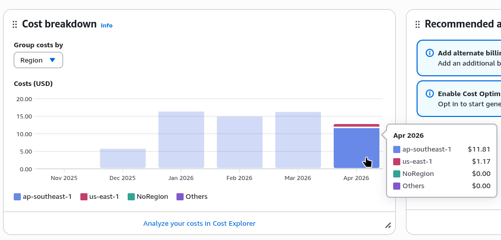

# Lab 16: Cloud AI Environment Setup — Báo cáo CPU Fallback

## 1. Tổng quan

Triển khai hạ tầng AWS bằng Terraform (IaC) cho bài toán **Credit Card Fraud Detection** sử dụng **LightGBM** trên CPU instance, theo phương án dự phòng Phần 7 của README_aws.md.
Có chút trục trặc nên em push code cũ qua nhánh khác để update lại cho phù hợp yêu cầu của bài thành ra nộp trễ ạ, a có thể review qua nhánh "ML" nếu cần ạ 😢

## 2. Lý do dùng CPU thay GPU

Tài khoản AWS Free Tier **chặn hoàn toàn** các instance type ngoài danh sách Free Tier eligible:

```
Error: api error FreeTierRestrictionError: This operation is not available 
for free plan accounts. To perform this action, please upgrade your account plan.

Error: api error InvalidParameterCombination: The specified instance type 
is not eligible for Free Tier.
```

Các instance bị chặn: `g4dn.xlarge` (GPU), `r5.2xlarge`, `t3.large`, `t3.medium`.

AWS chỉ cho phép **6 loại instance** Free Tier eligible, trong đó **`m7i-flex.large`** (2 vCPU, 8GB RAM) là lớn nhất — được chọn để chạy LightGBM.



## 3. Kiến trúc hạ tầng

| Thành phần | Giá trị |
|---|---|
| VPC | ML-VPC (`10.0.0.0/16`) |
| ML Node | `m7i-flex.large` (2 vCPU, 8GB) — Private Subnet |
| Bastion Host | `t3.micro` — Public Subnet |
| ALB | `ml-inference-alb-046ac33d-128325026.us-east-1.elb.amazonaws.com` |
| NAT Gateway | Cho phép ML Node truy cập internet |

## 4. Benchmark Results

### Screenshot chạy `benchmark.py`





### Bảng kết quả (Phần 7.6)

| Metric | Kết quả |
|---|---|
| Thời gian load data | 1.049 s |
| Thời gian training | 8.597 s |
| Best iteration | 157 |
| AUC-ROC | **0.983642** |
| Accuracy | **0.999473** |
| F1-Score | **0.836957** |
| Precision | 0.895349 |
| Recall | 0.785714 |
| Inference latency (1 row) | 0.212 ms |
| Inference throughput (1000 rows) | 162,463 rows/s |

## 5. AWS Billing





## 6. So sánh CPU vs GPU (Báo cáo ngắn)

1. **Instance type**: Dùng `m7i-flex.large` (CPU, 8GB RAM) thay vì `g4dn.xlarge` (GPU T4, 16GB) do Free Tier chặn GPU quota.
2. **Model**: LightGBM (gradient boosting) thay vì LLM (vLLM/Gemma) — phù hợp CPU, không cần GPU.
3. **Training time**: 8.6s trên CPU — rất nhanh vì LightGBM tối ưu cho CPU, không cần GPU acceleration.
4. **Inference**: 0.21ms/row, throughput 162K rows/s — hiệu suất cao trên CPU.
5. **Chi phí**: `m7i-flex.large` ~$0.10/h vs `g4dn.xlarge` ~$0.526/h — tiết kiệm ~80% chi phí mà vẫn đủ mạnh cho ML truyền thống.
