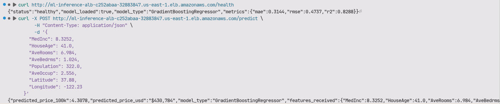
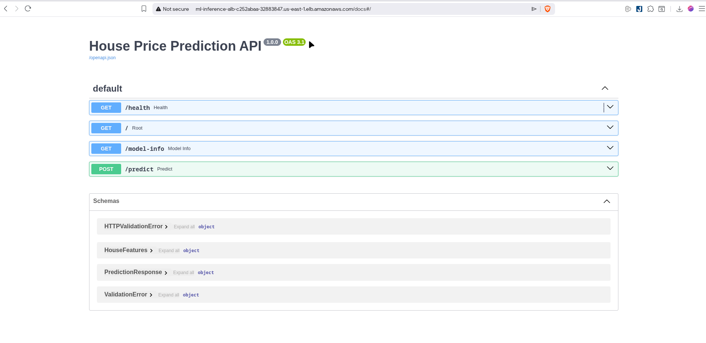
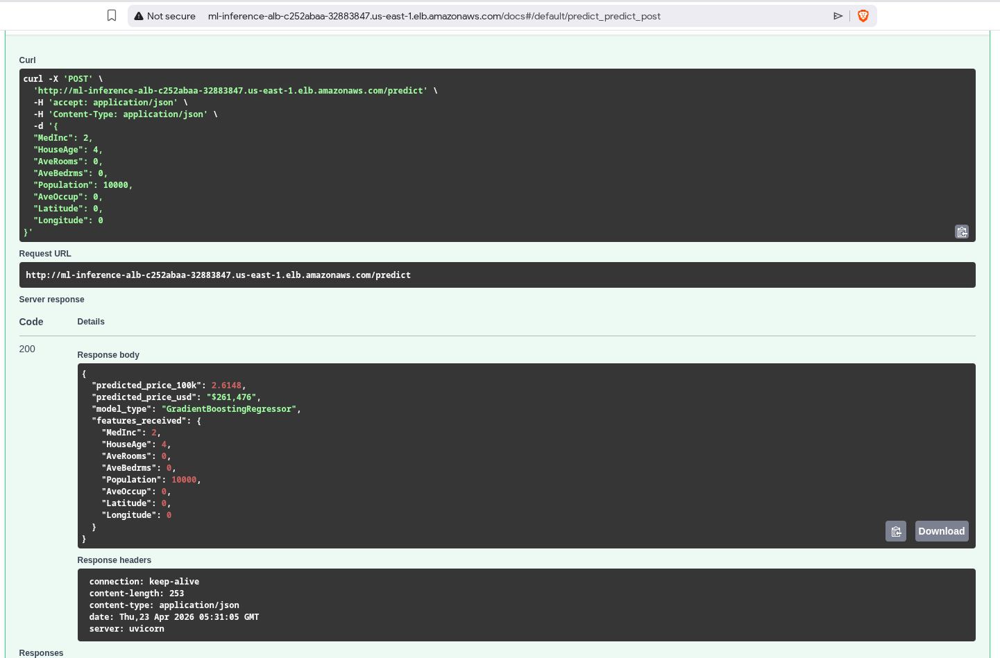
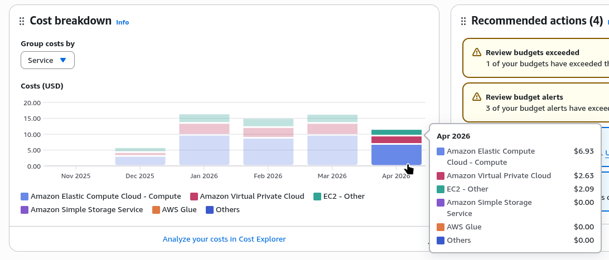

# Lab 16 — Báo cáo triển khai ML Endpoint trên AWS

## 1. API Predict thành công



## 2. Swagger UI



## 3. API Response chi tiết



## 4. AWS Billing - Billing bị trùng với con chatbot Discord e host nên không biết filter ra sao :)) 



## 5. Cold Start Time

| Giai đoạn | Thời gian |
|-----------|-----------|
| `terraform apply` (tạo hạ tầng) | ~2.5 phút |
| `user_data.sh` (cài Docker + build image + train model) | ~3.5 phút |
| **Tổng** | **~6 phút** |

## 6. Thông tin triển khai

| Mục | Giá trị |
|-----|---------|
| Instance type | `t3.small` (CPU) |
| AMI | Ubuntu 22.04 |
| Model | GradientBoostingRegressor (sklearn) |
| Dataset | California Housing |
| Serving | FastAPI + uvicorn (Docker) |
| Region | us-east-1 |
| ALB endpoint | `ml-inference-alb-c252abaa-32883847.us-east-1.elb.amazonaws.com` |

## 7. Model Benchmark (kết quả thực tế)

| Metric | Giá trị | Ý nghĩa |
|--------|---------|---------|
| MAE | 0.3144 | Sai số trung bình ~$31,440 |
| RMSE | 0.4737 | ~$47,370 |
| R² | 0.8288 | Giải thích 82.88% phương sai |

## 8. Sample Prediction

**Input:**
```json
{
  "MedInc": 8.3252, "HouseAge": 41.0, "AveRooms": 6.984,
  "AveBedrms": 1.024, "Population": 322.0, "AveOccup": 2.556,
  "Latitude": 37.88, "Longitude": -122.23
}
```

**Output:** `$430,784` (predicted_price_100k: 4.3078)
